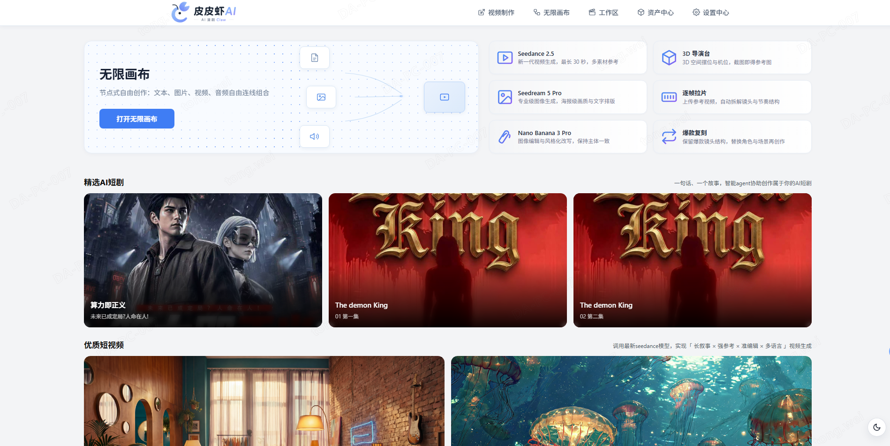
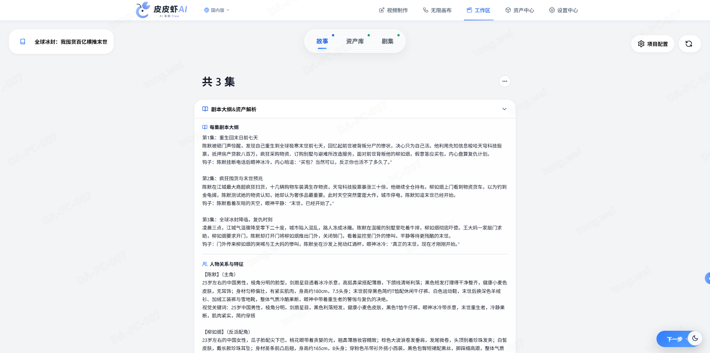
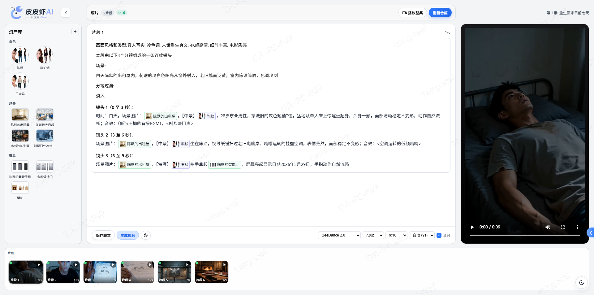
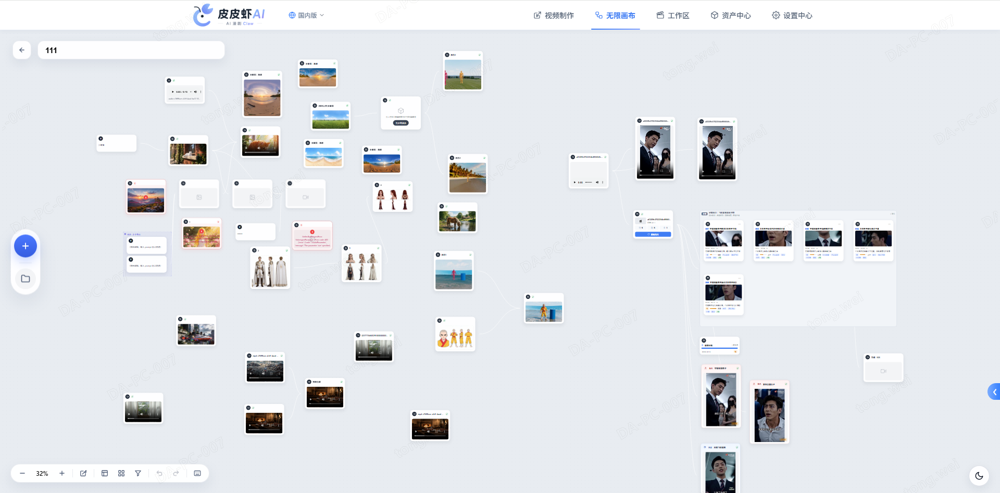
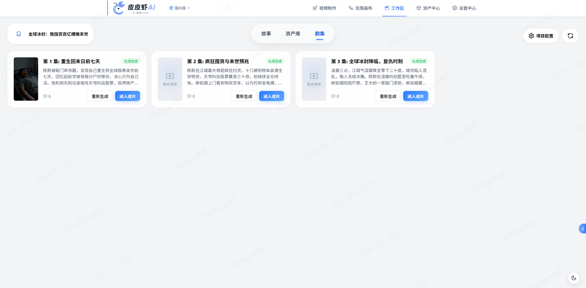
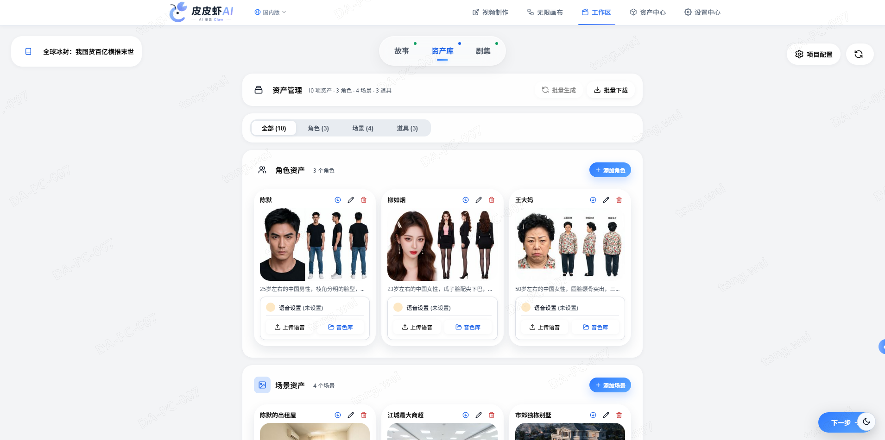
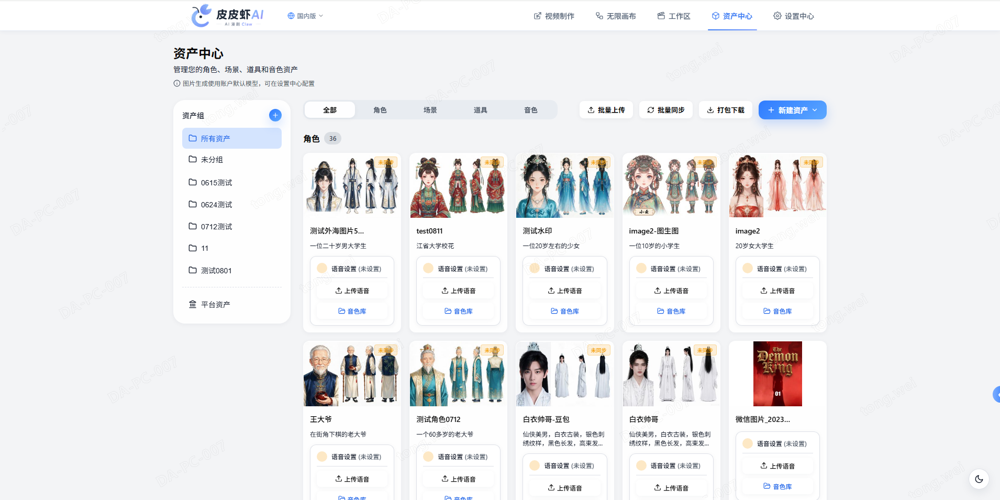

<div align="center">

<!-- Logo placeholder: put your logo at docs/images/logo.png and uncomment the line below -->
<!--  -->

# 🎬 Pipixia Drama

### AI-Powered Short Drama Production Platform — From Novel to Video, All in One Place

[简体中文](README.md) | **English**

**🌐 Live Demo: [https://www.datrix.com.cn/](https://www.datrix.com.cn/)**

[](https://www.python.org/)
[](https://fastapi.tiangolo.com/)
[](https://vuejs.org/)
[](https://www.postgresql.org/)
[](https://redis.io/)
[](https://docs.celeryq.dev/)

Paste a novel, and AI automatically analyzes the plot outline, characters,
scenes and props — then generates storyboard, character/scene/prop images,
voice-overs and videos, and finally assembles everything into a complete
short drama.

[Quick Start](#-quick-start) · [Features](#-features) · [Screenshots](#-screenshots) · [Configuration](#%EF%B8%8F-configuration) · [Contributing](#-contributing)



</div>

---

## ✨ Features

### 📖 Intelligent Script Creation
- **Novel Analysis**: paste novel text and AI generates the plot outline, character profiles & relationships, scene descriptions and prop lists
- **Storyboard Editor**: organize the story by scenes and shots; edit or regenerate dialogue and shot descriptions per storyboard item
- **Canvas Editor**: node-based freeform canvas where image/video generation nodes can be composed

### 🎨 AI Generation
- **Image Generation**: character, scene and prop images with character-consistency control and reference images
- **Video Generation**: text-to-video / image-to-video with "omni reference" (image + video reference assets)
- **Speech Synthesis**: text-to-speech and voice design with speed control
- **Video Super Resolution**: upscale generated videos up to 720P / 1080P / 2K / 4K

### 🗂️ Assets & Collaboration
- **Asset Center**: unified management of image/audio/video assets, reusable across projects, shareable from main accounts to sub-accounts
- **Multi-user System**: main account + sub-accounts with fine-grained permissions (project / asset CRUD)
- **Task System**: Celery async queue + Flower monitoring dashboard, real-time progress via WebSocket / SSE

### 💰 Operations (Optional)
- **Points Billing**: per-model/resolution/duration points billing with dual-account balance (granted / purchased)
- **Membership**: membership levels, privileges and points purchase plans
- **Payment**: built-in SandPay recharge module (can be disabled)

### ⚙️ Flexible Configuration
- **Multi-model Access**: Volcengine Ark (Doubao / Seedream / Seedance), DeepSeek, GPT image models, Alibaba Bailian (TTS) and more — all keys and models configurable
- **Project-level Settings**: each project can override model, resolution, art style, concurrency, etc., with config inheritance

## 📸 Screenshots

### Story Analysis
Paste novel text and AI generates the outline, character profiles & relationships, scenes and props


### Storyboard Editor
Organize the story by scenes and shots; edit dialogue and shot descriptions with live preview


### Canvas Editor
Node-based freeform canvas where image/video generation nodes can be composed


### Episode Generation
Shots are automatically assembled into episodes, with regeneration support


### Project Assets
Grouped character/scene assets within a project, reusable across the pipeline


### Asset Center
Unified management of image/audio/video assets, reusable and shareable


## 🏗️ Architecture

| Layer | Technology |
|-------|------------|
| Frontend | Vue 3 + Vite |
| Backend | FastAPI + SQLAlchemy 2.0 |
| Database | PostgreSQL 15+ |
| Cache / Queue | Redis 7+ + Celery (Worker / Beat / Flower) |
| Realtime | WebSocket / SSE |
| Object Storage | Tencent Cloud COS (replaceable) |
| AI Models | Volcengine Ark, DeepSeek, GPT image models, Alibaba Bailian (TTS), etc. |

```
┌─────────────┐     ┌──────────────────────────────────────────┐
│  Vue 3 App  │────▶│               FastAPI Backend             │
└─────────────┘     │  ┌────────┐ ┌────────┐ ┌──────────────┐   │
   WebSocket/SSE    │  │   API  │ │  Auth  │ │ AI Orchestration │
                    │  └───┬────┘ └───┬────┘ └──────┬───────┘   │
                    └──────┼──────────┼─────────────┼───────────┘
                           ▼          ▼             ▼
                    ┌──────────┐ ┌────────┐ ┌──────────────┐
                    │PostgreSQL│ │ Redis  │ │Celery Workers │
                    └──────────┘ └────────┘ └──────┬───────┘
                                                  ▼
                                    ┌─────────────────────────┐
                                    │ AI Models / COS Storage / Super Res │
                                    └─────────────────────────┘
```

## 🚀 Quick Start

### Prerequisites

| Dependency | Version | Notes |
|------------|---------|-------|
| Python | >= 3.12 | Backend runtime |
| Node.js | >= 18 | Frontend build |
| PostgreSQL | >= 15 | Main database |
| Redis | >= 5 | Cache & message queue |
| ffmpeg | >= 4 | Video concatenation & cover frame extraction; must be installed and on PATH |

### 1. Start PostgreSQL and Redis

Quick start with Docker (skip if you already have them):

```bash
docker run -d --name pipixia-pg -p 5432:5432 \
  -e POSTGRES_USER=postgres -e POSTGRES_PASSWORD=postgres \
  postgres:15

docker run -d --name pipixia-redis -p 6379:6379 redis:7
```

### 2. Initialize the Database

Create database `pipixia-drama`, then choose **one** of the following:

**Option A: Import the initial SQL (recommended, no backend dependencies required)**

```bash
psql -U postgres -d "pipixia-drama" -f sql/init.sql
```

**Option B: Run the init script** (see the [backend guide](backend/README.md); backend dependencies must be installed first)

```bash
cd backend
python scripts/init_db.py
```

### 3. Start the Backend

```bash
cd backend
python -m venv .venv
.venv\Scripts\activate          # Windows
# source .venv/bin/activate     # Linux / macOS

pip install -r requirements.txt

copy .env.example .env          # Windows
# cp .env.example .env          # Linux / macOS
# Edit .env: database connection and model API keys

uvicorn main:app --host 0.0.0.0 --port 8000
```

AI generation tasks rely on Celery — start the worker and beat in separate terminals:

```bash
cd backend
celery -A app.core.celery worker --loglevel=info -P gevent -c 100
celery -A app.core.celery beat --loglevel=info
```

### 4. Start the Frontend

```bash
cd frontend
npm install
npm run dev
```

Open `http://localhost:3000` (the dev server proxies `/api` requests to `http://127.0.0.1:8000`, so make sure the backend is running) and sign in with the default account:

| Username | Password |
|----------|----------|
| `test` | `123456` |

> ⚠️ For production deployments, always change the default password and `SECRET_KEY`.

## ⚙️ Configuration

The backend configuration file is `backend/.env` (copied from `.env.example`). Key settings:

| Setting | Required | Description |
|---------|----------|-------------|
| `SECRET_KEY` | ✅ | JWT signing key — replace with a random string |
| `DB_HOST` / `DB_PORT` / `DB_USER` / `DB_PASSWORD` / `DB_NAME` | ✅ | PostgreSQL connection |
| `REDIS_HOST` / `REDIS_PORT` / `REDIS_PASSWORD` | ✅ | Redis connection |
| `DEFAULT_USER_NAME` / `DEFAULT_USER_PASSWORD` | ✅ | Default account created by the init script |
| `TENCENT_COS_*` | Recommended | Tencent Cloud COS (image/video/audio storage) |
| `VOLC_ACCESSKEY` / `VOLC_SECRETKEY` | Optional | Volcengine keys (Doubao / Seedream / Seedance) |
| `VOLC_OVERSEA_*` | Optional | BytePlus (overseas) keys |
| `CALLBACK_BASE_URL` | Optional | Video generation callback URL (required for public deployment) |
| `SANDPAY_*` | Optional | SandPay merchant config (leave empty to disable recharge) |

> See the comments in [backend/.env.example](backend/.env.example) for the full list.

## 📖 Documentation

- [Backend Guide](backend/README.md) — installation, database initialization and service startup
- [Tech Design](docs/tech/) — architecture and detailed design docs (in Chinese)

## 🤝 Contributing

Issues and pull requests are welcome:

1. Fork this repository and create a feature branch
2. Make changes following the existing code style
3. Open a pull request describing your changes

## 📄 License

This project is open-sourced under the [MIT License](LICENSE).
